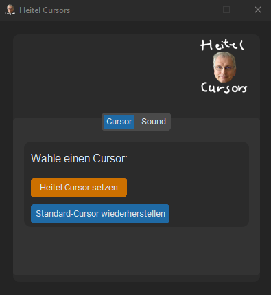

# Heitel Cursor Projekt

Willkommen zum Heitel Cursor Projekt! Diese Seite dient als zentrale Anlaufstelle für alle Informationen und Dokumentationen rund um das Projekt.

## Inhaltsverzeichnis

1. [Einführung](#einführung)
2. [Installation](#installation)
3. [Benutzung](#benutzung)
4. [Hauptfunktionen](#hauptfunktionen)
5. [Kommt bald](#kommt-bald)
6. [Beitragende](#beitragende)
7. [Lizenz](#lizenz)

## Einführung

Das Heitel Cursor Projekt ist ein Open-Source-Projekt, das darauf abzielt, eine benutzerfreundliche und effiziente Cursorsteuerung zu entwickeln. Heitel Cursors ist eine Windows-Anwendung, die es Nutzern ermöglicht, das Aussehen ihres Mauszeigers zu verändern. Die Software wurde von Creep Media entwickelt und befindet sich derzeit in der Beta-Phase. Sie zeichnet sich insbesondere dadurch aus, dass der Cursor vergrößert und durch ein Bild des Gesichts von Joachim Heitel ersetzt wird.

## Installation
Eine ausführbare Datei (EXE) der Anwendung kann von der [GitHub Releases-Seite](https://github.com/CreepTV/Heitel-Cursors/releases) heruntergeladen werden.

Anweisungen zur Installation des Projekts:

```bash
git clone https://github.com/username/heitel-cursor-projekt.git
cd heitel-cursor-projekt
npm install
```

## Benutzung

So verwenden Sie das Heitel Cursor Projekt:

```bash
npm start
```

## Hauptfunktionen

✔ **Individueller Cursor** – Ersetze den Standard-Mauszeiger durch den unverwechselbaren Heitel-Cursor. <br>
✔ **Vergrößerter Cursor** – Bessere Sichtbarkeit durch eine vergrößerte Darstellung. <br>
✔ **Einfache Bedienung** – Wechsel bequem zwischen verschiedenen Cursor-Designs per Schaltflächensteuerung. <br>

## :memo: Kommt bald

🔹 **Neue Steuerungsoptionen** – Einfacheres Umschalten zwischen verschiedenen Cursor-Designs per Tastenkombination. <br>
🔹 **Bessere Benutzeroberfläche** – Verbessertes Design für eine intuitivere und modernere Bedienung. <br>
🔹 **Bugfixes & Stabilitätsverbesserungen** – Behebt kleinere Probleme aus der Beta und sorgt für eine stabilere Anwendung. <br>
🔹 **Neue und verschiedene Cursor-Designs** – Ab sofort stehen dir noch mehr Cursor-Optionen zur Verfügung, um deinen Arbeitsbereich weiter zu personalisieren. <br>

### Images



## Beitragende

Vielen Dank an alle, die zu diesem Projekt beigetragen haben!

## Lizenz

Dieses Projekt steht unter der [GNU General Public License v3.0](LICENSE).
